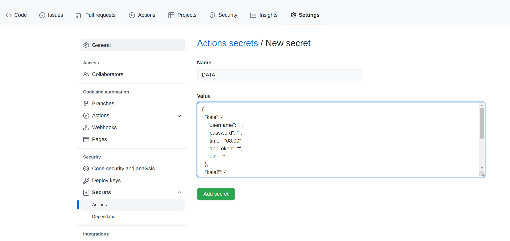
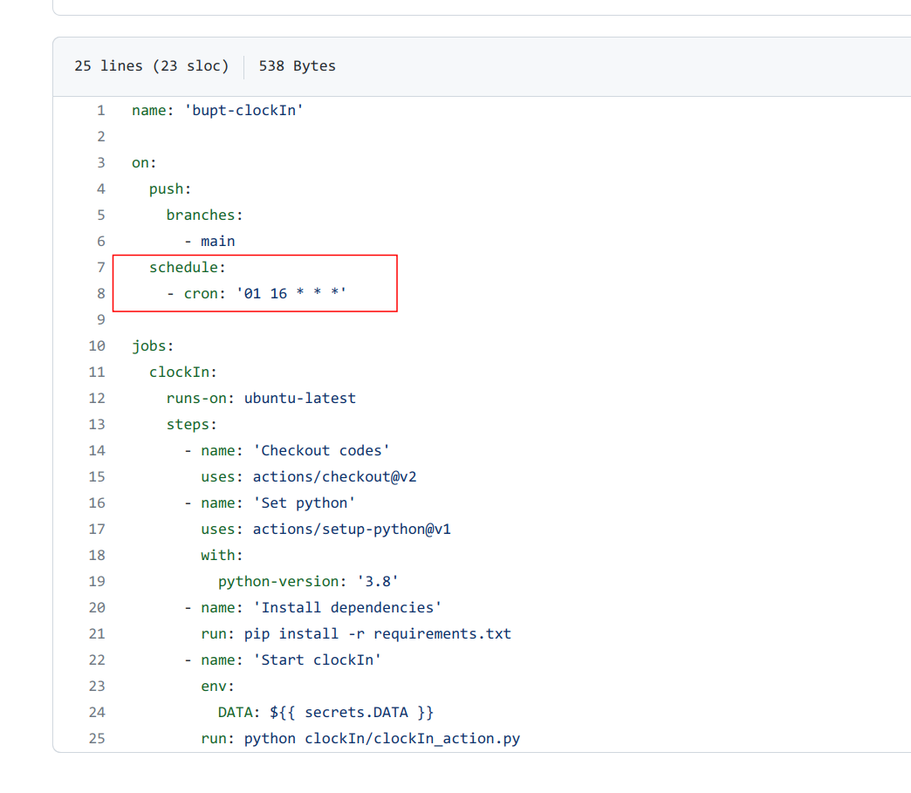
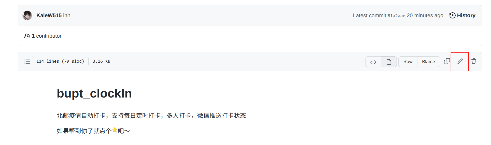
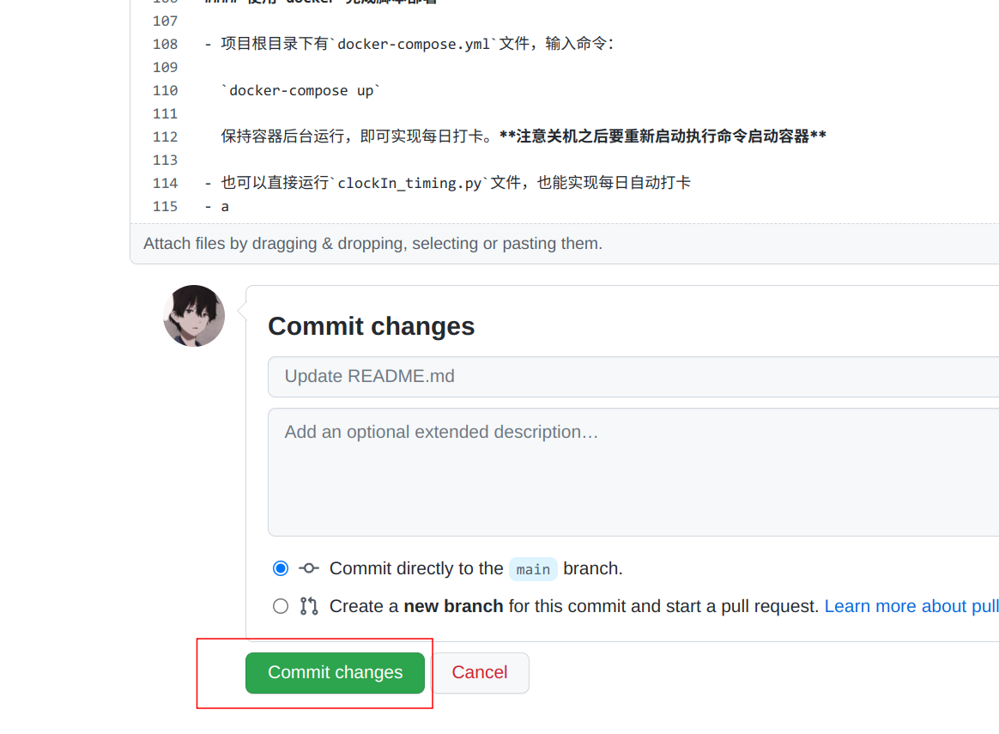
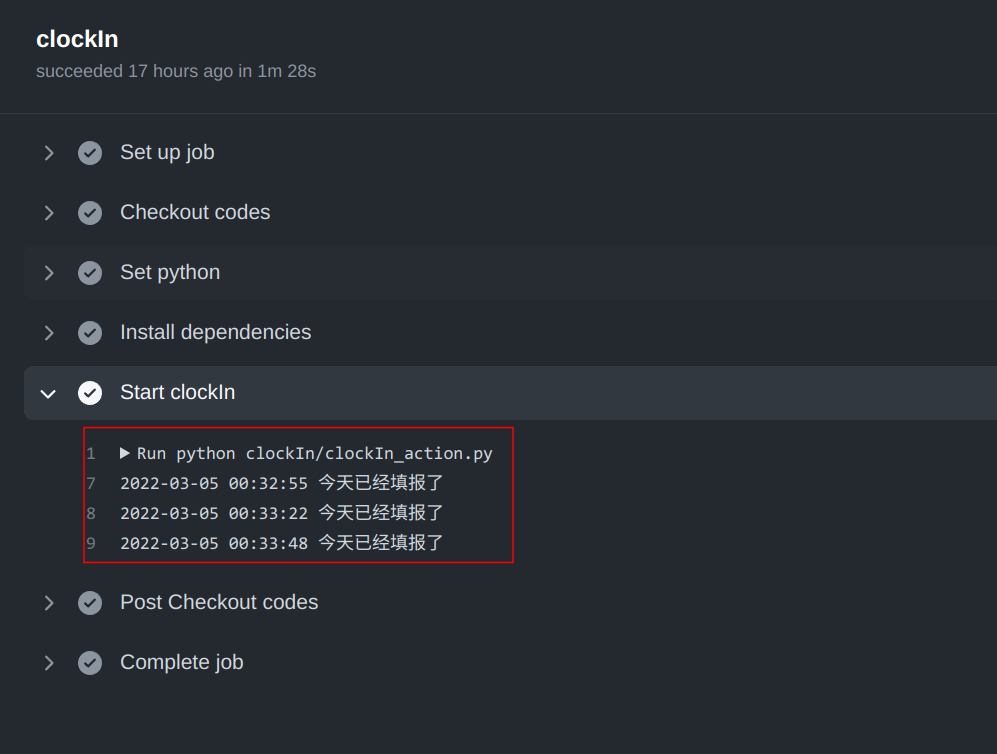
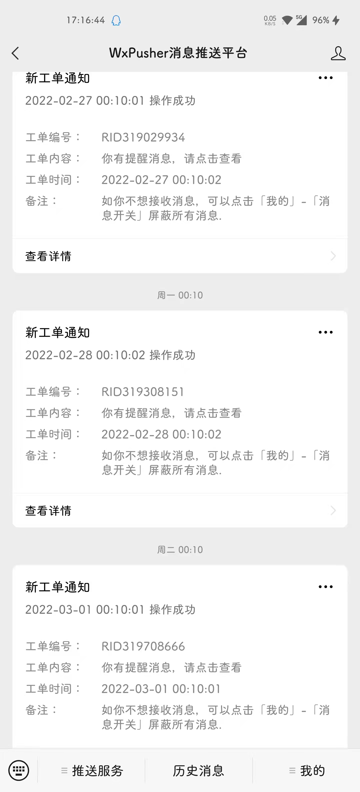

# bupt-clockIn
北邮疫情自动打卡，支持每日定时打卡，多人打卡，微信推送打卡状态，白嫖github action支持

如果帮到你了就点个:star:吧～

## Framework

```
├── clockIn                   // 代码及配置文件目录
│   ├── clockIn_action.py     // github action打卡脚本
│   ├── clockIn.py            // 打卡脚本，只会执行一次，需要配合类似cron等具有支持定时功能的服务实现每日打卡
│   ├── clockIn_timing.py     // 无需定时服务支持，支持每日打卡
│   └── config.json           // 配置文件
├── docker-compose.yml        // docker compose配置
├── img
├── LICENSE
├── README.md
└── requirements.txt          // 相关依赖
```

## How To Use

项目提供了两种打卡方式，如果你没有自己的服务器，可以选择第一种github action的方式进行打卡，如果你有自己的服务器，也可以选择第二种方式将项目部署到自己的服务器上。

### 相关配置

项目的配置主要是`config.json`文件里面的参数：

```json
{
  "kale": {
    "username": "",
    "password": "",
    "time": "08:00",
    "appToken": "",
    "uid": ""
  }
}
```

如上，`username`代表自己的学号，`password`代表自己的密码，`time`可以修改默认自动打卡的时间，默认是`9：30`，如修改为`08：30`则是每天`8：30`进行打卡，这里注意如果时间只有一位数一定要在前面添加`0`，比如`8：30`是错误的，应该改为`08：30`

**注：项目支持多人打卡**

#### 多人打卡

多人打卡只需要仿照如下配置写即可，如果只需要单用户打卡需要删去多余用户

```json
{
  "kale": {
    "username": "",
    "password": "",
    "time": "08:00",
    "appToken": "AT_",
    "uid": "UID_"
  },
  "kale2": {
    "username": "",
    "password": "",
    "time": "08:15",
    "appToken": "",
    "uid": ""
  }
}
```

#### 微信推送

如果不需要微信推送服务，则可以忽略该节。

本项目的微信推送用到了[WxPusher](https://github.com/wxpusher/wxpusher-client)，微信推送需要用到`config.json`配置文件中的`appToken`和`uid`字段。

1. 根据 [WxPusher](https://wxpusher.zjiecode.com/docs/#/)的文档首先注册并且创建应用，注册时会提示`appToken`，记录到`config.json`的`appToken`字段中

2. 创建完成后扫码关注应用，根据文档说明拿到自己的`uid`填到`config.json`中的`uid`字段中

3. 微信推送服务配置完成

   例如：

   ```json
   {
     "username": "2021xxxxxx",
     "password": "xxxxxxxxxx",
     "time": "09:30",
     "appToken": "AT_xxxxxxxxxxxxxxxxxxxx",
     "uid": "UID_xxxxxxxxxxxxxxxxxxxx"
   }
   ```

### 开始运行

#### github action

1. Fork本仓库，然后进入自己的仓库

2. 准备自己的配置文件，可以将项目clone下来编辑`config.json`文件，也可以直接在网页编辑，如果熟悉json结构，也可以自己在本地编辑。填好`username`以及`password`，如果需要微信推送，则根据上述微信推送一节中描述填上`appToken`以及`uid`，如果不需要则可以空着，编辑完成后复制全部内容

3. 点击自己仓库右上角的settings，点击左边的Secrets，再点击Actions，选择右上角的New repository secret，如下图，新建一个secret，Name为DATA，在Value里粘贴刚刚复制的配置

   

4. 设置好环境变量后点击你的仓库上方的Actions选项，第一次打开需要点击`I understand...`按钮，确认在Fork的仓库上启用GitHub Actions
5. 任意发起一次commit，可以参考以下步骤
   - 项目默认的打卡时间是每天的00:01，由于github action的原因，实际打卡时间可能会延后几十分钟，如果想要更改这个时间，可以更改仓库的`.github/workflows/main.yml`文件，如下图，更改`cron`的前两个字段，项目默认为`01 16`，即代表每天的16:01，由于中国在东八区，所以会加上8个小时，也就是每天的00:01，可以根据自己的需要进行更改，更改完别忘记commit
   - 如果不需要更改打卡时间，可以修改项目的`README.md`文件，如下图，点击`README.md`文件，然后点击右上角的:pen:
   - 在末尾任意加上一些内容然后进行提交，如下图，修改完别忘了提交
6. 提交完就设置好自动打卡了，第一次提交会自动执行一次，可以看一下仓库主页的Actions，按照下图步骤依次点击，如果看到填报信息，代表自动打卡部署成功了

#### 部署在自己服务器

有两种方式，如果你喜欢使用cron，可以使用第一种方式，如果你喜欢使用docker，可以使用第二种方式

首先是在服务器上clone本项目，并更改`config.json`文件的内容

##### 使用`cron`配合`clockIn.py`进行每日打卡

- 安装所需依赖：

  `pip install -r requirements.txt`

- 设置定时任务，例如

  `30 9 * * * python /home/kale/bupt-clockIn/clockIn.py`

  即可在每日的9点30分进行自动打卡

##### 使用`docker`完成脚本部署

- 项目根目录下有`docker-compose.yml`文件，输入命令：

  `docker-compose up`

  保持容器后台运行，即可实现每日打卡。

### 运行截图


